# :calendar:MOTIVE:thinking:
## What is Motive?
### Motive is an Event Sharing and Organisation Planning Native Android Application which allows users to create events, share said events with their friends, and add them to their in-app calendar, where they can additionally add their own private events. 
---
### Home Screen  

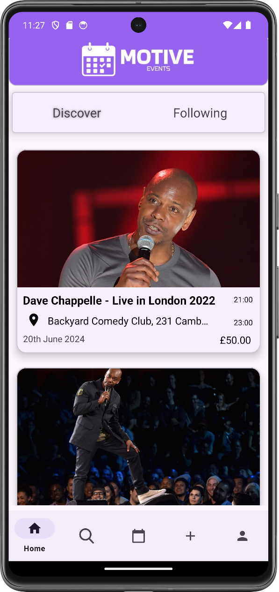 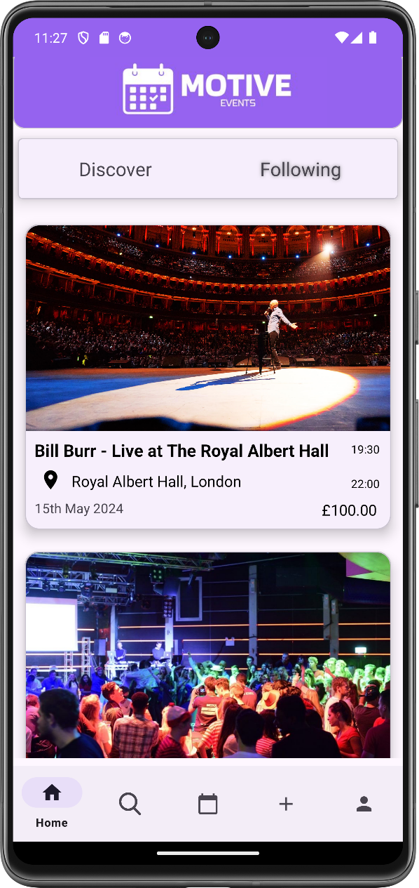  

The Home Screen offers two tabs:  
- **Discover**: All public events from all users are shown in order of upload date.  
- **Following**: Events from users you follow are shown in order of upload date.

---

### In-App Calendar
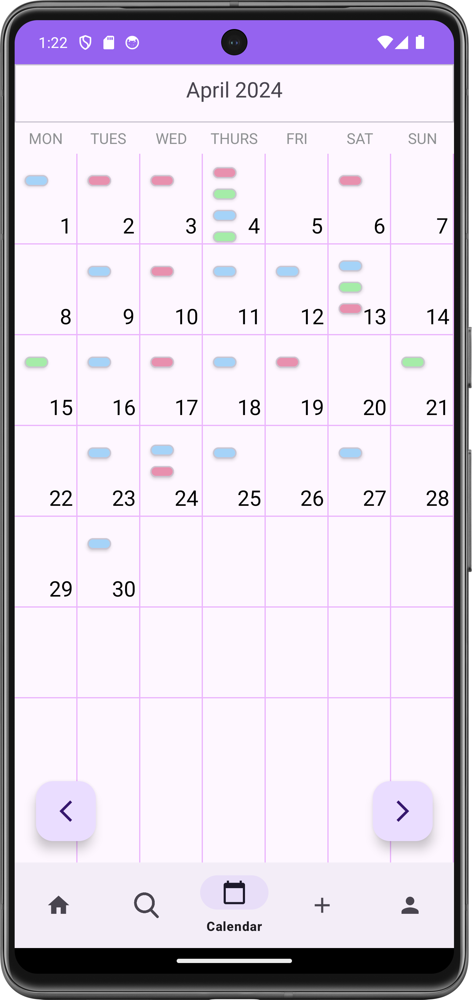
Each day is clickable, directing the user to the corresponding private events page for the day clicked.  Events are also shown as a preview on the month view.  

---

### Private Events

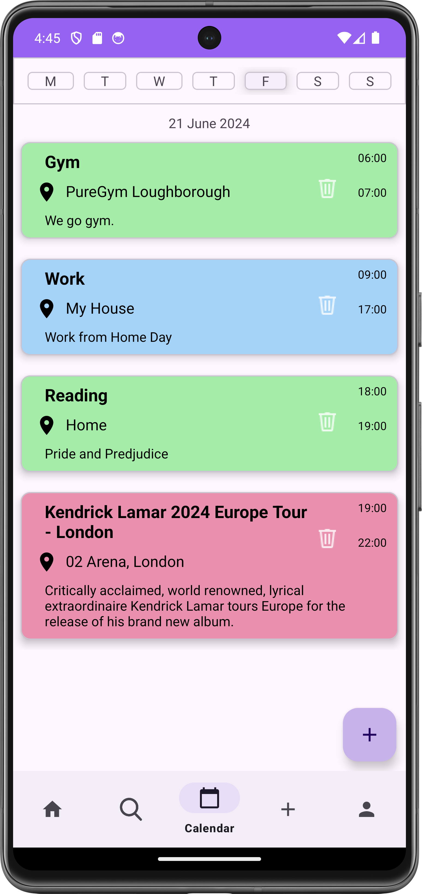 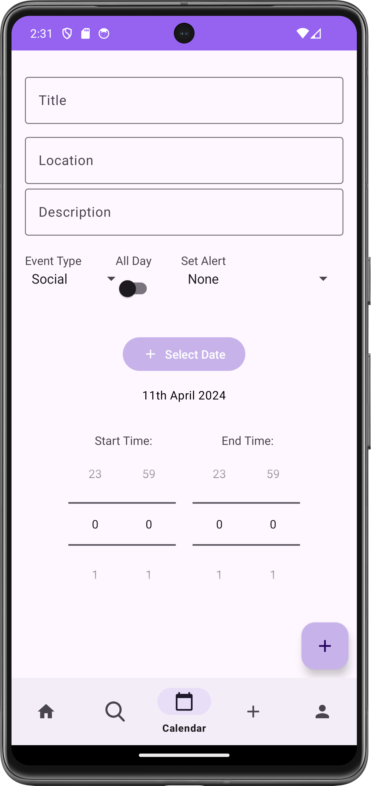 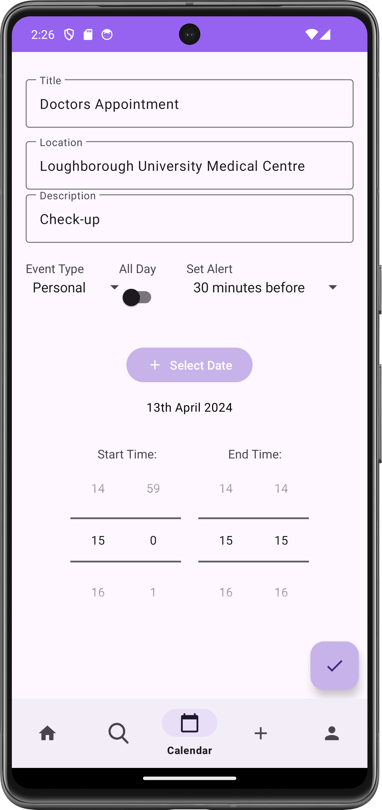 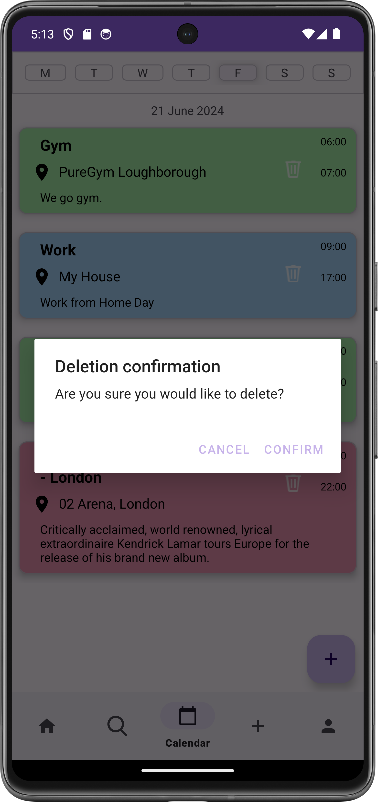 

Users can create private events directly, which are saved locally on their device and do not require any internet connection to access.  
Users can create custom events, and they are color-coordinated to the event type (e.g., Work - Blue).  
Public events are also shown here and can be deleted, which will remove your attendance from said event.  

---

### Public Events

Public Events can be accessed through clicking on them in the home page, or on a profile page.  

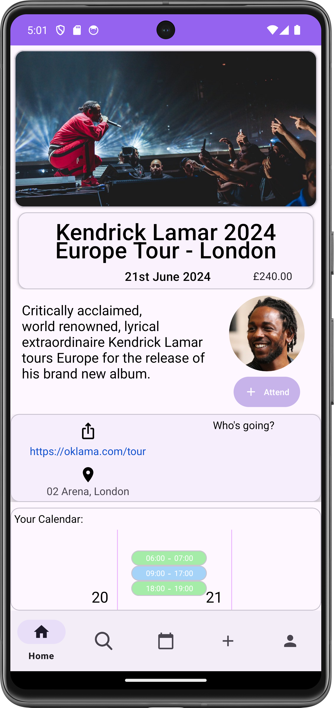 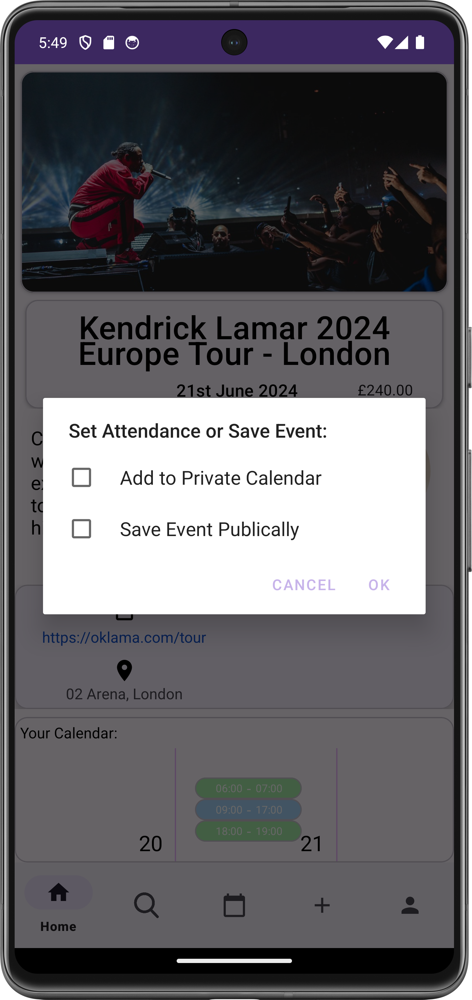  

The Public Event page offers an image, title, location, price and external link for the event. The uploader's profile picture is visible which directs to their profile page.  
Users can save an event, publically and/or privately, this will determine whether other users that follow them can view their attendance.

---
#### :point_right:	Calendar Preview

At the bottom of the page is the calendar preview, which displays the calendar of the user, from 2 days prior to the event to 2 days after (Horizontally scrollable).  

---

#### :point_right:	Attendance View

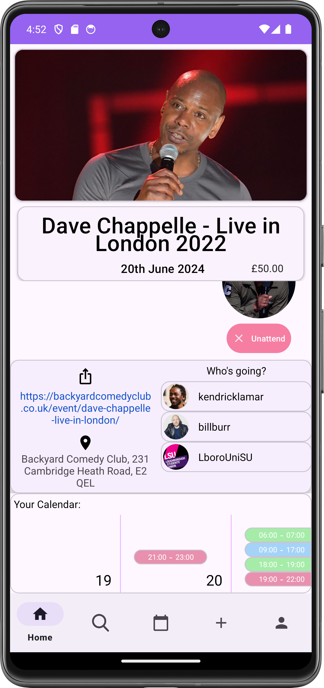  
Additionally, users can view whether the other users that they follow are attending the event.  

***

Both calendar preview and attendance view offer the user the ability to make an informed decision of their attendance, and whether they wish to publically display that.  

---

### Search  

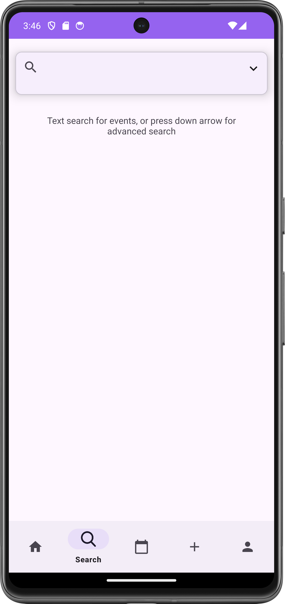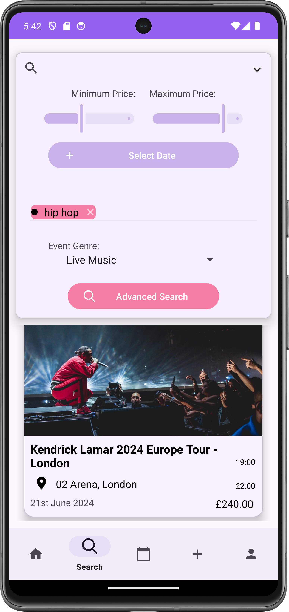  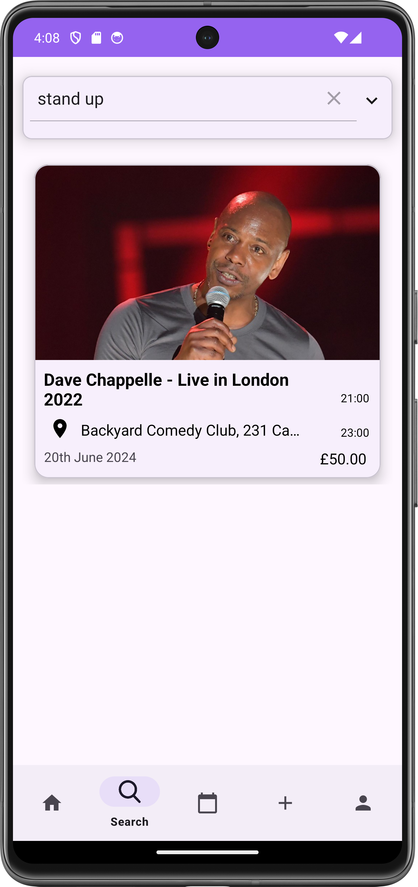  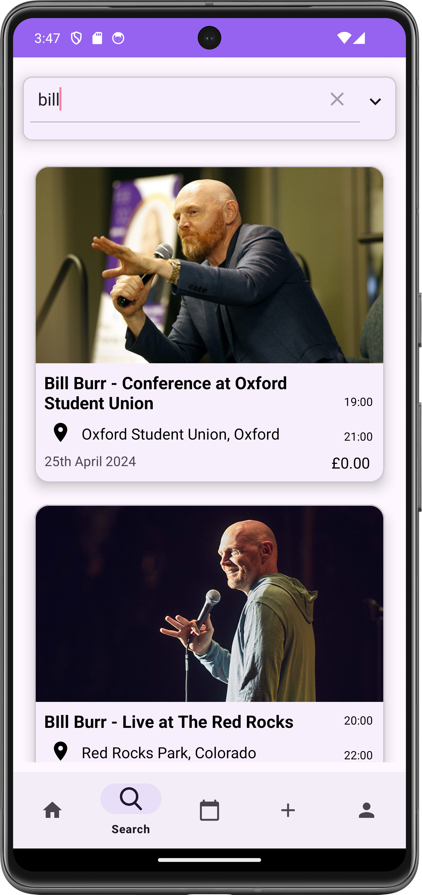  

The Search page grants 2 functions:
- **Text Search**: Users search across all public events, using Algolia Search API, which allows for searching across all attributes of event (e.g. tag, location, etc).  
- **Advanced Search**: Search parameters can be set such as price, date, tags and event genre.  

---

### Profiles  

Profiles can either be accessed via the profile tab (the user's own profile) or clicking on other user's profile pictures.  

---

#### Own Profile  

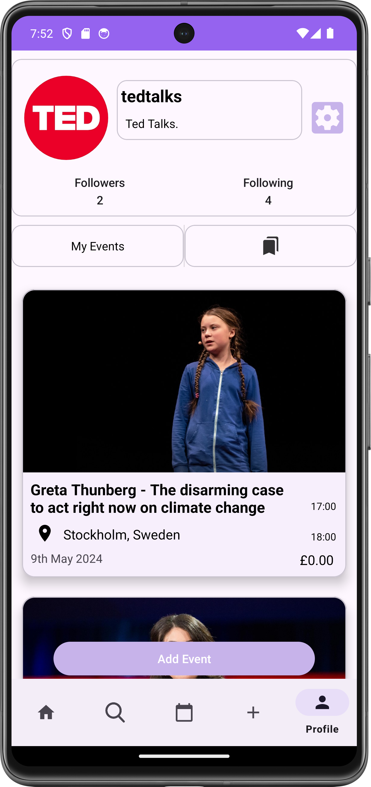 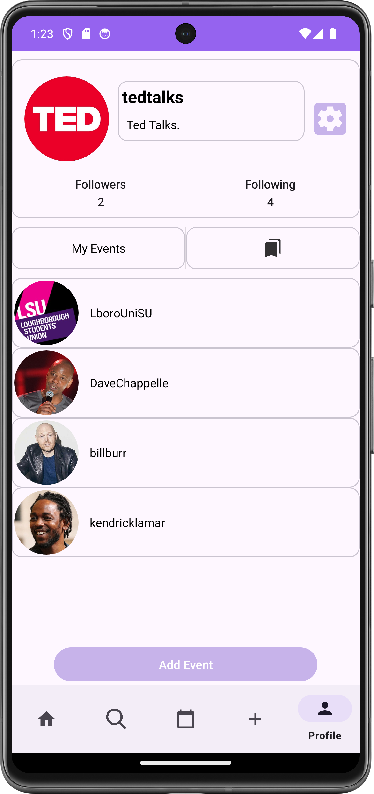

Users can view their event's that they have created or the events they have set to publically attend. Additionally clicking on their followers or following will display the correspinding users.

---

#### Other User's Profile  

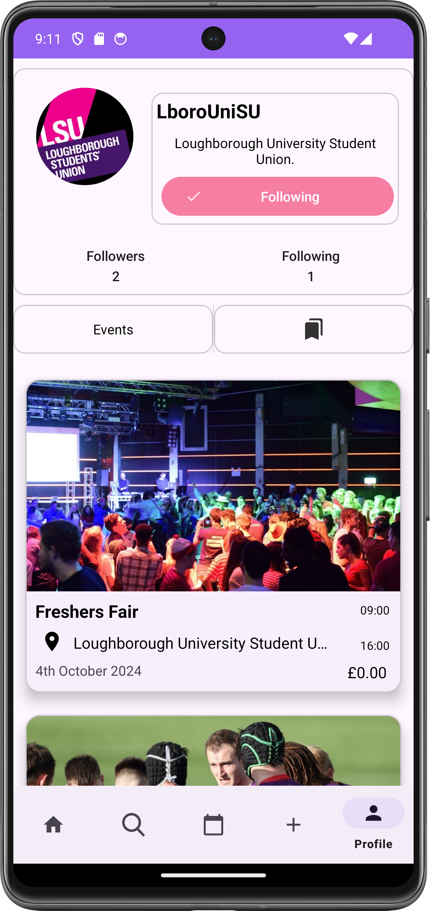

Users can follow other users on this page and view all their public events.  

---

Lastly, users can click add event at the bottom of the screen to create their own public event.  

---

### Public Event Creation  

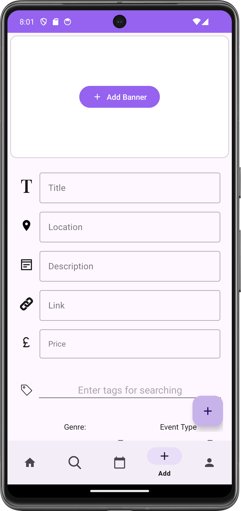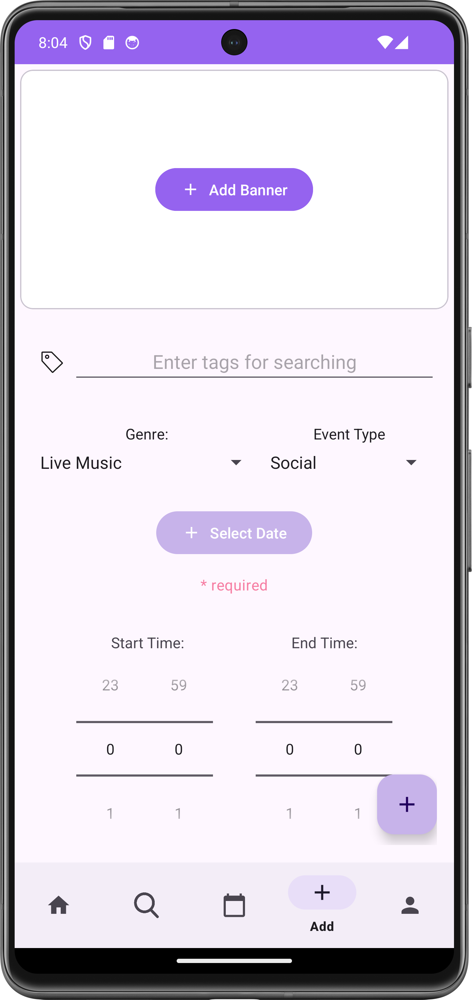  

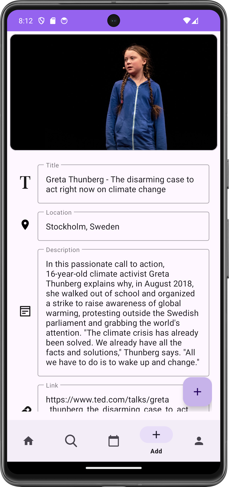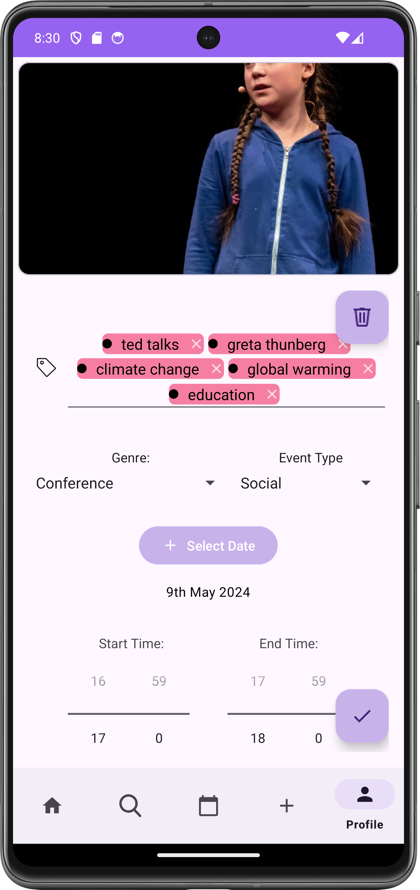

Users create a public event, including a banner image, title, location, description, link, price, tags, date, time, genre and type (for calendar colour correspondance).

---
