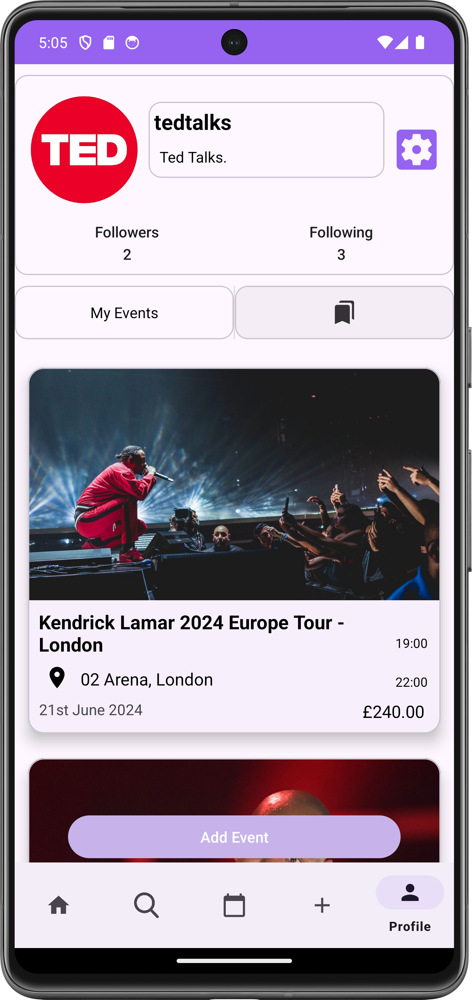

# MOTIVE
## Event Planning and Organisation Native Android Application
### What is Motive?
Motive is an application which allows users to create events, share said events with their friends, and add them to their in-app calendar, where they can additionally add their own private events. 
### Home Screen

### In-App Calendar

### Private Events
  

### Public Events

### Profiles

